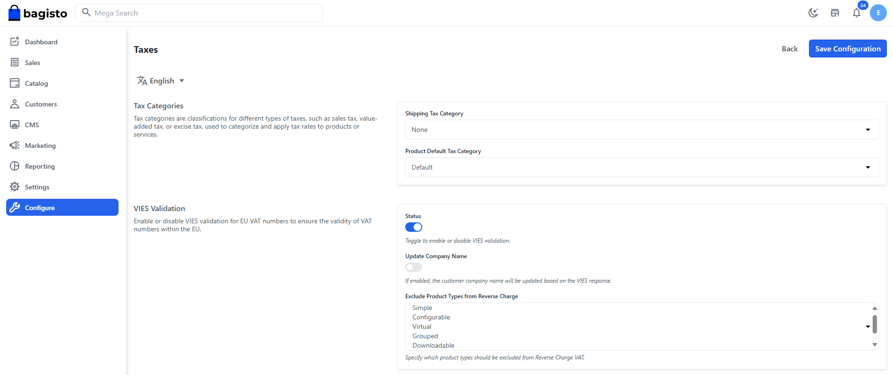

<div align="center">
  <a href="https://bagisto.eu"></a>
  <h2>VAT information Exchange System (VIES) Package</h2>
</div>

<div align="center">
    <a href="https://packagist.org/packages/bagisto-eu/vies"></a>  
</div>

## Overview

This package enables VAT number validation and reverse charge VAT handling for European businesses using Bagisto.  
It integrates with the VIES API to verify VAT numbers and dynamically adjusts tax calculations during checkout.

## Changelog

Please refer to the [Changelog](CHANGELOG.md) for detailed information on new features, fixes, and updates.

## Installation

1. **Install with composer**  
 ```bash
   composer require bagisto-eu/vies
```

2. **Run the following command to cache the config**

```bash
php artisan optimize
```

## Configuration
Once installed, configure the package in your Bagisto admin panel under **Sales > Taxes > VIES Validation**.



## Support
If you encounter any issues or have questions about this package, please reach out to our support team at [info@bagisto.eu](mailto:info@bagisto.eu). We're here to assist you.
